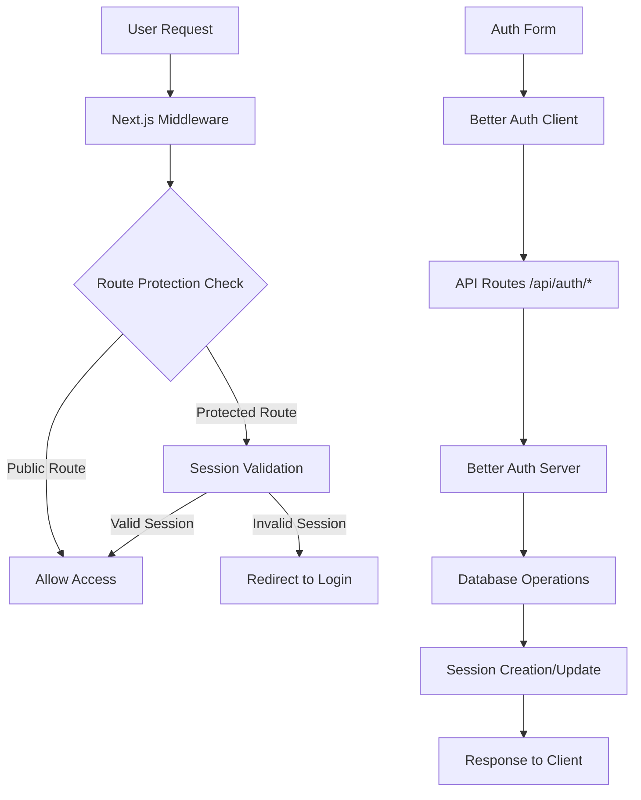
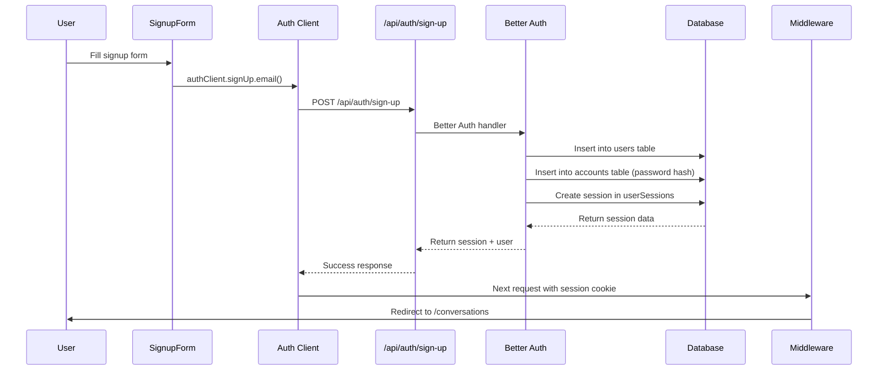
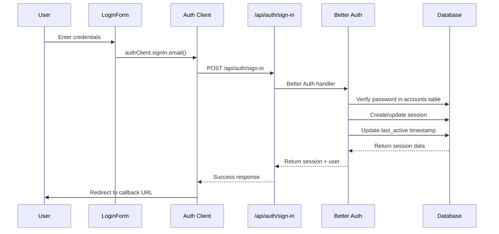
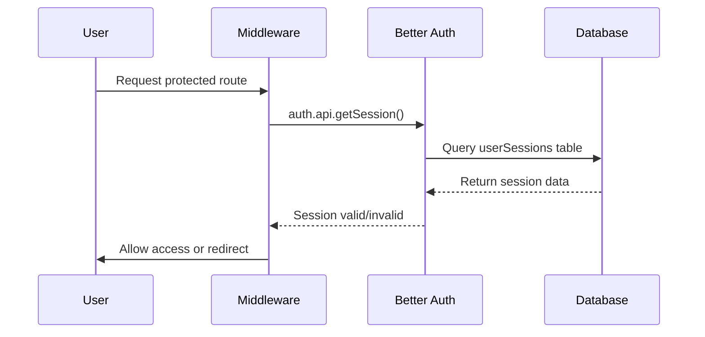
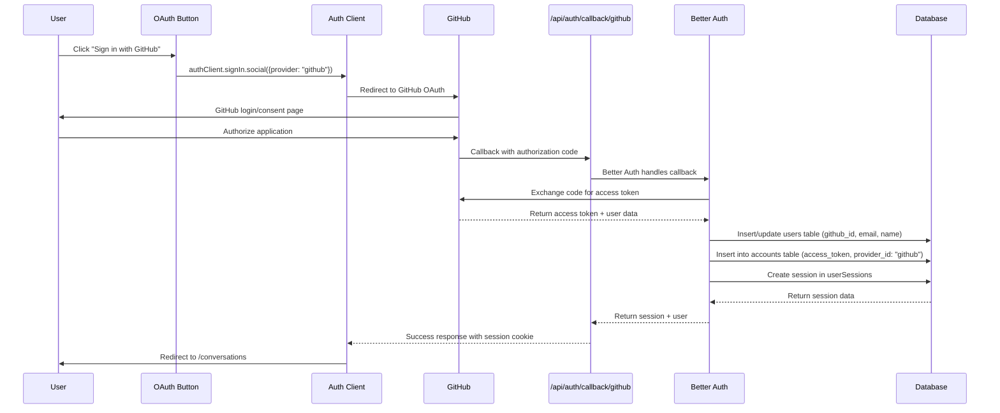
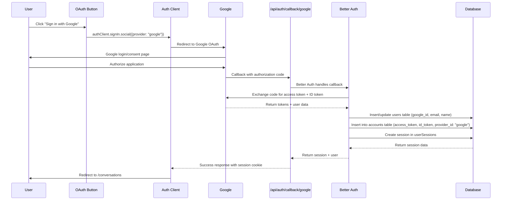

# T3 Chat Cloneathon - Authentication System Documentation

## Overview

This document provides an in-depth explanation of the authentication system in T3 Chat Cloneathon, built using Better Auth v1.2.9. The system implements secure user authentication with email/password signup/signin, session management, and route protection.

## Architecture Overview



## Database Schema

### Core Authentication Tables

#### 1. Users Table (`users`)

**Purpose**: Store user account information
**Table Name**: `t3-chat-cloneathon-app_user`

```sql
CREATE TABLE t3-chat-cloneathon-app_user (
  id UUID PRIMARY KEY DEFAULT gen_random_uuid(),
  email VARCHAR(255) UNIQUE NOT NULL,
  name VARCHAR(255),
  avatar_url VARCHAR(500),
  github_id VARCHAR(100) UNIQUE,  -- For GitHub OAuth (not yet implemented)
  google_id VARCHAR(100) UNIQUE,  -- For Google OAuth (not yet implemented)
  preferences JSONB DEFAULT '{}',
  created_at TIMESTAMP WITH TIME ZONE DEFAULT CURRENT_TIMESTAMP NOT NULL,
  updated_at TIMESTAMP WITH TIME ZONE DEFAULT CURRENT_TIMESTAMP
);
```

**Populated By**:

- **Signup**: `/api/auth/sign-up` endpoint
- **OAuth** (future): `/api/auth/callback/[provider]` endpoints

**Triggers**:

- User submits signup form
- OAuth provider callback (when implemented)

#### 2. User Sessions Table (`userSessions`)

**Purpose**: Manage active user sessions
**Table Name**: `t3-chat-cloneathon-app_user_session`

```sql
CREATE TABLE t3-chat-cloneathon-app_user_session (
  id UUID PRIMARY KEY DEFAULT gen_random_uuid(),
  user_id UUID REFERENCES t3-chat-cloneathon-app_user(id) ON DELETE CASCADE NOT NULL,
  session_token VARCHAR(255) UNIQUE NOT NULL,
  expires_at TIMESTAMP WITH TIME ZONE NOT NULL,
  device_info JSONB DEFAULT '{}',
  last_active TIMESTAMP WITH TIME ZONE DEFAULT CURRENT_TIMESTAMP NOT NULL,
  created_at TIMESTAMP WITH TIME ZONE DEFAULT CURRENT_TIMESTAMP NOT NULL
);
```

**Populated By**:

- **Login**: `/api/auth/sign-in` endpoint
- **Session Refresh**: Automatic via Better Auth middleware

**Triggers**:

- Successful user login
- Session token refresh (every 24 hours)
- Remember me option extends session to 7 days

#### 3. Accounts Table (`accounts`)

**Purpose**: Store OAuth provider account linking
**Table Name**: `t3-chat-cloneathon-app_account`

```sql
CREATE TABLE t3-chat-cloneathon-app_account (
  id UUID PRIMARY KEY DEFAULT gen_random_uuid(),
  user_id UUID REFERENCES t3-chat-cloneathon-app_user(id) ON DELETE CASCADE NOT NULL,
  account_id VARCHAR(255) NOT NULL,        -- Provider's user ID
  provider_id VARCHAR(100) NOT NULL,       -- 'github', 'google', etc.
  access_token TEXT,                       -- OAuth access token
  refresh_token TEXT,                      -- OAuth refresh token
  id_token TEXT,                           -- OpenID Connect ID token
  access_token_expires_at TIMESTAMP WITH TIME ZONE,
  refresh_token_expires_at TIMESTAMP WITH TIME ZONE,
  scope VARCHAR(500),                      -- OAuth scopes
  password VARCHAR(255),                   -- Encrypted password for email/password auth
  created_at TIMESTAMP WITH TIME ZONE DEFAULT CURRENT_TIMESTAMP NOT NULL,
  updated_at TIMESTAMP WITH TIME ZONE DEFAULT CURRENT_TIMESTAMP
);
```

**Populated By**:

- **Email/Password**: `/api/auth/sign-up` and `/api/auth/sign-in` endpoints
- **OAuth** (future): `/api/auth/callback/[provider]` endpoints

**Triggers**:

- User creates account with email/password
- User links OAuth provider (when implemented)

## Authentication Flow

### 1. Email/Password Signup Flow



**Endpoint**: `POST /api/auth/sign-up`
**Fields Populated**:

- `users.email`, `users.name`, `users.created_at`
- `accounts.password` (hashed), `accounts.provider_id` = 'credential'
- `userSessions.session_token`, `userSessions.expires_at`

### 2. Email/Password Signin Flow



**Endpoint**: `POST /api/auth/sign-in`
**Fields Updated**:

- `userSessions.last_active`
- Creates new session or updates existing one

### 3. Session Management

**Session Duration**:

- Default: 7 days (`expiresIn: 60 * 60 * 24 * 7`)
- Update frequency: 24 hours (`updateAge: 60 * 60 * 24`)
- Cookie cache: 5 minutes (`maxAge: 60 * 5`)

**Session Validation Flow**:



### 4. Route Protection

**Protected Routes**:

- `/conversations` - Main chat interface
- `/settings` - User settings
- `/profile` - User profile
- `/api/conversations` - Conversation API
- `/api/messages` - Messages API
- `/api/user` - User API

**Middleware Logic** (`src/middleware.ts`):

1. Check if route requires authentication
2. Extract session from request headers
3. Validate session with Better Auth
4. Allow/deny access or redirect accordingly

## API Endpoints

### Authentication Endpoints

| Endpoint                    | Method | Purpose                 | Schema Impact                                       |
| --------------------------- | ------ | ----------------------- | --------------------------------------------------- |
| `/api/auth/sign-up`         | POST   | Create new user account | Inserts into `users`, `accounts`, `userSessions`    |
| `/api/auth/sign-in`         | POST   | Authenticate user       | Updates `userSessions.last_active`, creates session |
| `/api/auth/sign-out`        | POST   | Terminate user session  | Deletes from `userSessions`                         |
| `/api/auth/session`         | GET    | Get current session     | Queries `userSessions` join `users`                 |
| `/api/auth/user`            | GET    | Get current user        | Queries `users` table                               |
| `/api/auth/user`            | PATCH  | Update user profile     | Updates `users` table                               |
| `/api/auth/callback/github` | GET    | GitHub OAuth callback   | Inserts/updates `users`, `accounts`, `userSessions` |
| `/api/auth/callback/google` | GET    | Google OAuth callback   | Inserts/updates `users`, `accounts`, `userSessions` |

### Request/Response Examples

#### Signup Request

```json
POST /api/auth/sign-up
{
  "name": "John Doe",
  "email": "john@example.com",
  "password": "securepassword123"
}
```

#### Signin Request

```json
POST /api/auth/sign-in
{
  "email": "john@example.com",
  "password": "securepassword123",
  "rememberMe": true
}
```

#### Session Response

```json
{
  "user": {
    "id": "uuid-here",
    "email": "john@example.com",
    "name": "John Doe",
    "createdAt": "2024-01-01T00:00:00.000Z"
  },
  "session": {
    "id": "session-uuid",
    "userId": "uuid-here",
    "expiresAt": "2024-01-08T00:00:00.000Z"
  }
}
```

## OAuth Providers Status

### Current Implementation: ✅ FULLY IMPLEMENTED

OAuth authentication with GitHub and Google is **now fully configured and ready to use** alongside email/password authentication.

### What's Been Implemented:

✅ **Provider Configuration**: GitHub and Google OAuth providers configured in Better Auth  
✅ **UI Components**: OAuth buttons with GitHub and Google branding  
✅ **Authentication Hooks**: `signInWithGitHub()`, `signInWithGoogle()`, `signInWithOAuth()` methods  
✅ **Database Schema**: Full OAuth token storage in accounts table  
✅ **Callback Handlers**: OAuth callback URLs configured for both providers

### OAuth Authentication Flow

#### 1. GitHub OAuth Flow



**Endpoint**: `GET /api/auth/callback/github`  
**Fields Populated**:

- `users.github_id` - GitHub user ID
- `users.email`, `users.name`, `users.avatar_url` - From GitHub profile
- `accounts.account_id` - GitHub user ID
- `accounts.provider_id` = "github"
- `accounts.access_token` - GitHub access token
- `accounts.scope` - GitHub OAuth scopes
- `userSessions.session_token`, `userSessions.expires_at`

#### 2. Google OAuth Flow



**Endpoint**: `GET /api/auth/callback/google`  
**Fields Populated**:

- `users.google_id` - Google user ID
- `users.email`, `users.name`, `users.avatar_url` - From Google profile
- `accounts.account_id` - Google user ID
- `accounts.provider_id` = "google"
- `accounts.access_token` - Google access token
- `accounts.id_token` - OpenID Connect ID token
- `accounts.scope` - Google OAuth scopes ("openid email profile")
- `userSessions.session_token`, `userSessions.expires_at`

### OAuth vs Email/Password Account Linking

**Account Linking Logic**:

1. **Same Email Match**: If OAuth email matches existing email/password account, accounts are linked
2. **New OAuth User**: Creates new user with OAuth provider data
3. **Multiple Providers**: One user can have multiple OAuth providers linked

**Database Relationships**:

```sql
-- User with multiple auth methods
User: { id: "uuid-1", email: "john@example.com", github_id: "12345", google_id: "67890" }

-- Multiple accounts for same user
Account 1: { user_id: "uuid-1", provider_id: "credential", password: "hashed..." }
Account 2: { user_id: "uuid-1", provider_id: "github", account_id: "12345", access_token: "..." }
Account 3: { user_id: "uuid-1", provider_id: "google", account_id: "67890", access_token: "..." }
```

### OAuth Configuration

The OAuth providers are configured in `src/server/auth/config.ts`:

```typescript
socialProviders: {
  github: {
    clientId: process.env.GITHUB_CLIENT_ID!,
    clientSecret: process.env.GITHUB_CLIENT_SECRET!,
    redirectURI: "http://localhost:3000/api/auth/callback/github", // Dev
    // redirectURI: "https://your-domain.com/api/auth/callback/github", // Prod
  },
  google: {
    clientId: process.env.GOOGLE_CLIENT_ID!,
    clientSecret: process.env.GOOGLE_CLIENT_SECRET!,
    redirectURI: "http://localhost:3000/api/auth/callback/google", // Dev
    // redirectURI: "https://your-domain.com/api/auth/callback/google", // Prod
    scope: ["openid", "email", "profile"],
  },
}
```

## Security Features

### 1. Password Security

- **Hashing**: Better Auth uses secure password hashing (bcrypt)
- **Minimum Length**: 8 characters enforced client-side
- **Storage**: Hashed passwords stored in `accounts.password`

### 2. Session Security

- **HTTP-Only Cookies**: Session tokens stored in secure cookies
- **CSRF Protection**: Built-in CSRF protection
- **Session Rotation**: Tokens rotate on login/refresh

### 3. Rate Limiting

- **Configuration**: 100 requests per minute per IP
- **Scope**: Applied to all auth endpoints
- **Storage**: In-memory (Redis recommended for production)

### 4. Input Validation

- **Client-Side**: Form validation in React components
- **Server-Side**: Better Auth validates all inputs
- **Sanitization**: XSS protection built-in

## Error Handling

### Common Error Scenarios

| Error               | Trigger                    | User Experience            | Database Impact |
| ------------------- | -------------------------- | -------------------------- | --------------- |
| Invalid credentials | Wrong email/password       | Error message in form      | No changes      |
| Duplicate email     | Signup with existing email | "Email already exists"     | No changes      |
| Session expired     | Token past expiration      | Redirect to login          | Session deleted |
| Rate limit          | Too many requests          | "Please slow down" message | No changes      |

### Error Response Format

```json
{
  "error": {
    "message": "Invalid credentials",
    "code": "INVALID_CREDENTIALS",
    "status": 401
  }
}
```

## Environment Variables Required

```env
# Required for Better Auth
BETTER_AUTH_SECRET="your-32-character-secret-key-here"
BETTER_AUTH_URL="http://localhost:3000"
NEXT_PUBLIC_APP_URL="https://your-domain.com"  # Production only

# OAuth Providers - REQUIRED for OAuth functionality
GITHUB_CLIENT_ID="your-github-client-id"
GITHUB_CLIENT_SECRET="your-github-client-secret"
GOOGLE_CLIENT_ID="your-google-client-id"
GOOGLE_CLIENT_SECRET="your-google-client-secret"

# Database (already configured)
DATABASE_URL="postgresql://..."
```

## OAuth Setup Instructions

### 1. GitHub OAuth App Setup

**Step 1**: Go to GitHub Settings

- Navigate to GitHub → Settings → Developer settings → OAuth Apps
- Click "New OAuth App"

**Step 2**: Configure OAuth App

- **Application name**: `T3 Chat Cloneathon`
- **Homepage URL**: `http://localhost:3000` (dev) or `https://your-domain.com` (prod)
- **Authorization callback URL**: `http://localhost:3000/api/auth/callback/github` (dev) or `https://your-domain.com/api/auth/callback/github` (prod)

**Step 3**: Get Credentials

- Copy the `Client ID` → Set as `GITHUB_CLIENT_ID`
- Generate and copy `Client Secret` → Set as `GITHUB_CLIENT_SECRET`

### 2. Google OAuth App Setup

**Step 1**: Go to Google Cloud Console

- Navigate to [Google Cloud Console](https://console.cloud.google.com/)
- Create new project or select existing project

**Step 2**: Enable Google+ API

- Go to APIs & Services → Enabled APIs & services
- Click "+ ENABLE APIS AND SERVICES"
- Search for "Google+ API" and enable it

**Step 3**: Create OAuth 2.0 Credentials

- Go to APIs & Services → Credentials
- Click "Create Credentials" → OAuth 2.0 Client ID
- Select "Web application"

**Step 4**: Configure OAuth Client

- **Name**: `T3 Chat Cloneathon`
- **Authorized JavaScript origins**:
  - `http://localhost:3000` (dev)
  - `https://your-domain.com` (prod)
- **Authorized redirect URIs**:
  - `http://localhost:3000/api/auth/callback/google` (dev)
  - `https://your-domain.com/api/auth/callback/google` (prod)

**Step 5**: Get Credentials

- Copy the `Client ID` → Set as `GOOGLE_CLIENT_ID`
- Copy the `Client secret` → Set as `GOOGLE_CLIENT_SECRET`

### 3. OAuth Scopes Requested

**GitHub Scopes** (automatically requested):

- `user:email` - Access user email address
- `read:user` - Access basic user profile information

**Google Scopes** (configured in auth config):

- `openid` - OpenID Connect
- `email` - Access user email address
- `profile` - Access basic user profile information

### 4. Testing OAuth Integration

**Development Testing**:

```bash
# 1. Set environment variables in .env.local
# 2. Start development server
pnpm dev

# 3. Visit http://localhost:3000/login
# 4. Click "Sign in with GitHub" or "Sign in with Google"
# 5. Complete OAuth flow
# 6. Should redirect to /conversations
```

**Production Setup**:

- Update redirect URIs in OAuth apps to use production domain
- Set production environment variables
- Test OAuth flow on production domain

## Development vs Production

### Development Configuration

```typescript
// Local development
baseURL: "http://localhost:3000";
trustedOrigins: ["http://localhost:3000"];
```

### Production Configuration

```typescript
// Production
baseURL: process.env.NEXT_PUBLIC_APP_URL;
trustedOrigins: [process.env.NEXT_PUBLIC_APP_URL];
```

## Monitoring and Analytics

### Session Analytics

The system tracks:

- `userSessions.last_active` - User activity
- `userSessions.device_info` - Device information
- `userSessions.created_at` - Session creation time

### Performance Metrics

- Session lookup performance via database indexes
- Authentication endpoint response times
- Failed login attempt tracking

## Troubleshooting

### Common Issues

1. **Session not persisting**

   - Check cookie settings in browser
   - Verify `BETTER_AUTH_SECRET` environment variable

2. **Redirect loops**

   - Check middleware route configuration
   - Verify protected routes array

3. **Database connection errors**
   - Verify PostgreSQL connection string
   - Check database migration status

### Debug Commands

```bash
# Check database schema
pnpm db:studio

# Verify migrations
pnpm db:generate && pnpm db:push

# Check middleware logs
# Look for "Middleware auth error" messages
```

## Summary

This authentication system provides a **complete, production-ready foundation** for the T3 Chat Cloneathon application with:

✅ **Email/Password Authentication** - Fully functional signup/signin  
✅ **OAuth Authentication** - GitHub and Google OAuth integration  
✅ **Account Linking** - Multiple auth methods per user  
✅ **Session Management** - Secure 7-day sessions with automatic refresh  
✅ **Route Protection** - Middleware-based authentication guards  
✅ **Security Features** - Rate limiting, CSRF protection, secure cookies  
✅ **TypeScript Integration** - Full type safety throughout  
✅ **Custom Design System** - All components use your design tokens

**Ready to use**: Email/password authentication works immediately  
**OAuth ready**: Requires OAuth app setup with GitHub/Google to enable OAuth buttons  
**Production ready**: Secure, scalable authentication system with comprehensive error handling
